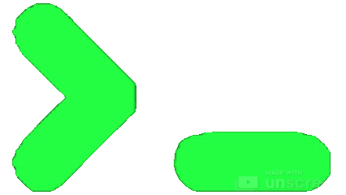

<p align="center">
  &nbsp;
  &nbsp;
  &nbsp;
  <a href="https://github.com/bastndev/Lynxjs-Pack"></a>
</p>

</br>

| Icon                                                                                                                                                                                                                                                                         | Name                                                                                                                           | Description                                                                                                                                                                                        |
| ---------------------------------------------------------------------------------------------------------------------------------------------------------------------------------------------------------------------------------------------------------------------------- | ------------------------------------------------------------------------------------------------------------------------------ | -------------------------------------------------------------------------------------------------------------------------------------------------------------------------------------------------- |
| [](https://marketplace.visualstudio.com/items?itemName=bastndev.lynx-theme)                                           | [ Lynx Theme](https://github.com/bastndev/Lynx-Theme)                             | A professional extension with six available themes: Dark, Light, Night, Ghibli, Coffee, and Kiro—with integrated icons. Each theme is optimized to offer a more pleasant visual experience.        |
| [](https://marketplace.visualstudio.com/items?itemName=bastndev.bracket-lynx)                                     | [ Bracket Lynx](https://github.com/bastndev/Bracket-Lynx)                         | Enhances the development experience by displaying a label next to each closing parenthesis, indicating the name of the corresponding block or function, along with the start and end line numbers. |
| [](https://marketplace.visualstudio.com/items?itemName=bastndev.lynx-keymap)                                                                                    | [ Lynx Keymap Pro](https://github.com/bastndev/Lynx-Keymap)                       | Standardizes keyboard shortcuts across all code editors, allowing you to use key combinations to access any functionality. It improves workflow and development experience.                        |
| [](https://marketplace.visualstudio.com/items?itemName=bastndev.lynx-js-snippets)                         | [ LynxJS Snippets (.tsx)](https://github.com/bastndev/Lynx-js-Snippets)           | A collection of optimized code snippets designed to accelerate web and mobile development in LynxJS projects. It automates the writing of common code structures.                                  |
| [](https://marketplace.visualstudio.com/items?itemName=bastndev.f1)                                                      | [ F1-Quick Switch](https://github.com/bastndev/f1)                                | Allows you to control editor functions and manage extensions directly from the keyboard, streamlining your workflow with configurable shortcuts.                                                   |
| [](https://marketplace.visualstudio.com/items?itemName=esbenp.prettier-vscode)                                        | [ Prettier](https://github.com/prettier/prettier)                                 | Code formatter that enforces a consistent style by parsing your code and reprinting it with its own rules. Supports JavaScript, TypeScript, CSS, HTML and more.                                    |
|                                                        | [ Code Spell Checker](https://github.com/streetsidesoftware/vscode-spell-checker) | A basic spell checker that works well with code and documents. Helps catch common spelling errors in comments, strings, and text.                                                                  |
| [](https://marketplace.visualstudio.com/items?itemName=wayou.vscode-todo-highlight)                          | [ TODO Highlight](https://github.com/wayou/vscode-todo-highlight)                 | Highlight TODO, FIXME and other annotations within your code. Helps you keep track of important comments and reminders in your codebase.                                                           |
| [](https://marketplace.visualstudio.com/items?itemName=bradlc.vscode-tailwindcss)                | [ Tailwind CSS](https://github.com/tailwindlabs/tailwindcss-intellisense)         | Intelligent Tailwind CSS tooling for VS Code. Provides autocomplete, syntax highlighting, and linting for Tailwind CSS classes.                                                                    |
|                                                                                        | [ Error Lens](https://github.com/usernamehw/vscode-error-lens)                    | Improve code quality by making errors and warnings more visible. Highlights the entire line wherever a diagnostic is generated and prints the message inline.                                      |
| [](https://marketplace.visualstudio.com/items?itemName=kisstkondoros.vscode-gutter-preview) | [ Gutter Preview](https://github.com/kisstkondoros/gutter-preview)                | Shows image preview in the gutter and on hover. Supports various image formats and makes it easy to visualize images referenced in your code.                                                      |
| [](https://marketplace.visualstudio.com/items?itemName=pflannery.vscode-versionlens)                     | [ Version Lens](https://gitlab.com/versionlens/vscode-versionlens)                | Shows version information when opening a package or project. Displays the latest version for each package and allows easy updating of dependencies.                                                |
| [](https://marketplace.visualstudio.com/items?itemName=eamodio.gitlens)                                                 | [ GitLens](https://github.com/gitkraken/vscode-gitlens)                           | Supercharge Git inside VS Code. Visualize code authorship, explore repositories, gain valuable insights via rich visualizations and powerful comparison commands.                                  |

### [+] Optional: Fonts & (75%) keyboard

- **[Fonts](https://github.com/bastndev/Lynx-Theme/releases/tag/v1.2.5)**
- **[Lynx Keymap (75%)](https://marketplace.visualstudio.com/items?itemName=bastndev.lynx-keymap-75)**

> **Note:** Keep your extensions updated regularly to get the latest features and security fixes.

</br>

## Installation

Launch _Quick Open_

-  Linux `Ctrl+P`
-  macOS `⌘P`
-  Windows `Ctrl+P`

Paste the following command and press `Enter`:

```
ext install bastndev.lynxjs-pack
```

## Contributing

If you want to contribute, check the guidelines: [[>_ᅠ]](https://github.com/bastndev/Lynxjs-Pack/blob/main/CONTRIBUTING.md).

| [](https://bastndev.com) |
| :---------------------------------------------------------------------------: |
|               **[Gohit Bastian](https://github.com/bastndev)**                |

## About Me

- [🐦 X](https://twitter.com/bastndev) - For questions and discussions.
- 🔴 [Youtube](https://www.youtube.com/@bastndev?sub_confirmation=1) - Code, Software and development insights.
- 💼 [Linkedin](https://www.linkedin.com/in/bastndev) - Professional networking and career updates.

**Enjoy 🎉 Your LynxJS pack is now active. If you find any bugs or have feedback, you can [open an issue](https://github.com/bastndev/LynxJs-Packge/issues).**
